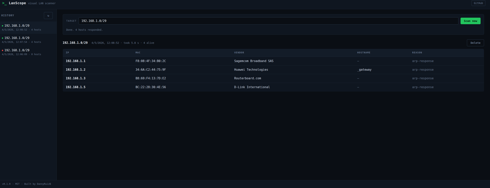

# LanScope

> Visual LAN scanner for your home network or homelab — point it at a CIDR, see who's there.



🟢 Stable — v0.8.3 (feature-complete, maintenance-only).

---

## Why

Most LAN-scanning tools are command-line only or feel stuck in 2005. LanScope is a small web UI on top of `nmap` that lets you launch a scan, browse alive hosts, and see how the network is laid out.

It is **not** a security scanner — no exploit detection, no vulnerability database. The goal is *visibility*: who's on your network, what they expose, what changed since last time.

## Scope

- Designed for **your own LAN** (home network, homelab, small office). Scan only networks you have permission to scan.
- Runs on a Linux host with Docker. The container shares the host network so `nmap` sees your real LAN.
- All data is stored locally in SQLite. Nothing leaves the machine.

## Use it

From v0.8.1 the easiest way is to pull a pre-built image from **GHCR** — no local build needed:

```bash
mkdir lanscope && cd lanscope
cat > docker-compose.yml <<'YAML'
services:
  lanscope:
    image: ghcr.io/dannyruizb/lanscope:latest
    container_name: lanscope
    network_mode: host
    cap_add:
      - NET_RAW
      - NET_ADMIN
    restart: unless-stopped
    environment:
      PORT: 3030
      DB_PATH: /var/lib/lanscope/lanscope.db
    volumes:
      - lanscope-data:/var/lib/lanscope
volumes:
  lanscope-data:
YAML
docker compose up -d
# open http://localhost:3030
```

Pin a specific version in production (e.g. `ghcr.io/dannyruizb/lanscope:0.8.3`) so an upgrade is always intentional. Images are multi-arch — `linux/amd64` for desktops / NUCs and `linux/arm64` for Raspberry Pi 4 / 5 and Apple-silicon homelabs.

Or build locally from source:

```bash
git clone https://github.com/DannyRuizB/lanscope.git
cd lanscope
docker compose up -d --build
# open http://localhost:3030
```

Type a CIDR in the **Target** input (for example `192.168.1.0/24`) and hit **Scan now**. Hosts that respond to the ping sweep appear in the table with their IP, MAC, vendor (looked up from the OUI prefix by `nmap`) and reverse-DNS hostname when available. Every scan is saved in the **History** sidebar — click any past scan to reload it.

### Port scan (v0.2, refined in v0.3.1)

Each host row has a **Scan ports** button in the *Ports* column. Click it and LanScope runs `nmap --top-ports 100 -sT -sV --version-light --reason` against that single host. Using a full TCP-connect scan (`-sT`) instead of SYN means an `open` result is a *real* completed handshake — no ambiguous `filtered` middle ground. The UI reflects this with two binary states:

- 🟢 **`accessible (TCP)`** — handshake completed, something is listening on that port.
- ⚪ **`not available`** — anything else (closed, filtered, no response, refused…).

Below each pill the **technical reason** is shown in small text (`syn-ack`, `conn-refused`, `no-response`…) so you keep the underlying detail.

If nmap identifies the service as web (`http`, `https`, `http-alt`, `http-proxy`, `https-alt`…), the port number itself becomes a clickable green link that opens `http://ip:port` (or `https`) in a new tab. Non-web services stay as plain text — *accessible (TCP)* doesn't mean a browser will get a useful response, just that the port is alive.

Once a host has been port-scanned the button changes to `N open · ▾` and toggles the sub-panel open / closed without re-scanning. Port results are persisted in the database with the host, so they survive a restart.

### Advanced options

A collapsible **Advanced options** panel sits below the *Scan now* form. The chosen values apply to the next port scan you trigger.

- **Port scan timing** — nmap's `-T0..T5` template, default `T4` (Aggressive). Lower values are slower and stealthier (`T0` Paranoid, `T1` Sneaky, `T2` Polite); higher values are faster but more likely to lose results on flaky networks (`T5` Insane).
- **Scan technique** — *Connect (TCP)* (default, `-sT`) completes the full TCP handshake, so an `accessible (TCP)` pill means nmap really shook hands. *SYN* (`-sS`) sends a SYN and waits for SYN-ACK without completing the handshake — faster and stealthier, but firewalls that drop SYN-ACK silently can leave ports indistinguishable from genuinely closed. The pills stay binary in both modes; the underlying nmap reason (`syn-ack`, `reset`, `conn-refused`, `no-response`…) appears in small text and is what tells the two techniques apart.
- **Ports** — pick between *Top N* (the default, runs `nmap --top-ports N` over nmap's most common TCP ports — 10 / 100 / 1000 / 5000) and *Range* (an explicit `-p` spec like `80`, `1-1024` or `22,80,443,8000-8100`). Range input is validated server-side as a strict regex before reaching nmap, with each token checked against `1 ≤ N ≤ M ≤ 65535`.
- **NSE scripts** *(v0.5)* — two checkboxes: *Default* (the same set nmap runs with `-sC`: banner grabs, `http-title`, `ssh-hostkey`, `ssl-cert` …) and *Safe* (broader — everything nmap classifies as non-intrusive). You can enable one, both or neither (default). Output appears inside the existing TCP sub-row — host-level scripts in a block above the ports table, port-level scripts in a panel directly under the row that triggered them. Other categories (`vuln`, `exploit`, `brute`, `intrusive`, `dos`) are deliberately **not exposed**: LanScope is a visibility tool, not a security scanner. Validation is allowlist-only — anything outside `{default, safe}` is rejected before reaching `execFile`.
- **Host discovery** *(v0.6)* — applies to the CIDR sweep, not the per-host scans. *Skip discovery* (`-Pn`) tells nmap to treat **every host in the CIDR as up** and run no probes — useful when ICMP and SYN are both blocked, but you'll get a row per IP whether the host is real or not. The four lower checkboxes — *ICMP echo* (`-PE`), *TCP SYN* (`-PS`), *TCP ACK* (`-PA`), *ARP* (`-PR`) — are mutually combinable: nothing checked uses nmap's defaults (echo + TCP SYN to 443 + TCP ACK to 80 + ICMP timestamp, plus ARP on local LAN); checking some restricts nmap to **only** those. `-Pn` is mutually exclusive with the per-type checks and disables them when on. Validation is allowlist-only.

### UDP scan (v0.4)

Each host row also has a **Scan UDP** button in the *UDP* column. Click it and LanScope runs `nmap -sU -sV --version-light --reason` against that single host (using whichever ports / timing you have selected in the *Advanced options* panel). Because UDP has no handshake, nmap waits on timeouts: a top-100 scan typically takes **5–15 minutes** on `-T4`, so a confirmation prompt asks before starting. The scan runs server-side with a 30-minute hard timeout.

UDP states map to a tri-state pill — different from the TCP binary, on purpose:

- 🟢 **`responsive`** — `open`. A service replied to nmap's probe (typically because `-sV` sent a service-specific payload like a DNS query, NTP request or SNMP get).
- 🟡 **`unknown`** — `open|filtered`. No response. The port may be open *or* a firewall may have dropped both the probe and any ICMP unreachable. UDP cannot tell these apart, and that ambiguity is the *normal* outcome — not noise.
- ⚪ **`closed`** / **`filtered`** — ICMP port-unreachable received (closed) or another ICMP unreachable filtered explicitly (filtered).

The TCP binary (`accessible (TCP)` / `not available`) does *not* apply here: in UDP, `open|filtered` is the dominant outcome and squashing it into "not available" would be misleading. The reason for keeping the tri-state in UDP is the same reason the binary works for TCP: present what's actually informative, hide what would only confuse.

UDP results live in their own expandable sub-row, independent from the TCP ports and OS sub-rows — all three can be open at once. The button label changes from `Scan UDP` to `N responsive · ▾` (or `N unknown · ▾` if nothing was openly responsive but at least one port was *open|filtered*).

### OS fingerprint (v0.3)

Each host row also has a **Scan OS** button in the *OS* column. Click it and LanScope runs `nmap -O --osscan-guess` against that single host. Results appear in their own expandable sub-table listing every candidate match nmap reports, sorted by accuracy: match name (e.g. *Linux 5.0 - 6.2*, *Microsoft Windows 10 1803*, *Motorola SURFboard 5101 cable modem*), accuracy %, OS family, vendor and device type.

The OS column shows a one-letter family **chip** so you can scan a `/24` and see the OS landscape at a glance — `[L]` Linux, `[W]` Windows, `[M]` macOS / iOS, `[B]` BSD, `[R]` router / embedded, `[U]` other Unix, `[?]` unknown. The chip in the button reflects the top match; the full ranking sits inside the sub-table.

OS sub-row and ports sub-row are independent — you can have both expanded for the same host at the same time. Both are persisted, so revisiting a scan doesn't re-run nmap.

### How it works under the hood

- The container runs a small Express server on port `3030`.
- `POST /api/scan` shells out to `nmap -sn -T4 [-Pn | -PE -PS -PA -PR …] -oX - <cidr>`. Output is XML, parsed in JavaScript with `fast-xml-parser`. Discovery flags are optional and validated server-side against an allowlist before reaching `execFile`.
- `POST /api/hosts/:id/portscan` shells out to `nmap (--top-ports N | -p <spec>) (-sT | -sS) -sV -T<n> --version-light --reason [--script=default,safe] -oX - <ip>` and persists the result, including each port's `state_reason` from nmap. Defaults are `--top-ports 100 -sT -T4`; ports selection, scan technique, timing and NSE script categories are all overridable via the *Advanced options* panel and validated server-side before reaching `execFile`. NSE output is parsed from `<port><script>` (port-level) and `<hostscript><script>` (host-level) and stored alongside the ports.
- `POST /api/hosts/:id/udp-portscan` shells out to `nmap (--top-ports N | -p <spec>) -sU -sV -T<n> --version-light --reason -oX - <ip>`. Reuses the same ports and timing options; scan technique does not apply (UDP-only flow). 30-minute server-side timeout to accommodate the inherent slowness of UDP scanning.
- `POST /api/hosts/:id/osscan` shells out to `nmap -O --osscan-guess -T4 -oX - <ip>`. Every `osmatch` reported is stored, including its first `osclass` (vendor / family / generation / device type).
- Hosts, ports and OS matches are stored in a SQLite database mounted on a Docker named volume (`lanscope-data`), so scan history survives restarts.
- The compose file uses `network_mode: host` and adds the `NET_RAW` and `NET_ADMIN` capabilities to the container — without those, `nmap` can't open the raw sockets that the ping sweep, SYN scan and OS fingerprint need.

### Caveats

- **Linux only.** `network_mode: host` doesn't behave the same on Docker Desktop for macOS / Windows: the container would only see Docker's internal network, not your real LAN.
- **Same subnet.** LanScope scans whatever subnet the host machine can reach. To scan a remote network you'd need a VPN or to run LanScope on a host inside that network.
- **Not a security scanner.** No exploit detection, no CVE matching. If you need that, use Nessus, OpenVAS or similar.
- **Large port ranges with mostly-closed ports show only the interesting ones.** When more than 25 ports share the same state (e.g. `closed`), nmap collapses them into an `<extraports>` summary in its XML output and only emits individual `<port>` entries for the ones that stand out (typically `open`). LanScope currently shows just the individual ports, so a `Range` of `1-65535` against a sparsely-listening host may render as a short list. The handful of *accessible* ports you do see are still accurate.

## Roadmap

LanScope's direction: cover as many `nmap` options as possible behind a visual UI, **additively** — current defaults stay one click away, advanced flags become opt-in panels.

- [x] **v0.1** — CIDR ping sweep. Web UI with a "Scan now" form, results table (IP, MAC, vendor, hostname). Persisted scan history in SQLite.
- [x] **v0.2** — Per-host TCP port scan (top 100 ports) with detected service names, products and versions. Expandable sub-table per host, results persisted alongside the host.
- [x] **v0.3** — OS fingerprint (`nmap -O --osscan-guess`). Per-host OS column with one-letter family chip, expandable sub-table with every candidate match ranked by accuracy.
- [x] **v0.3.1** — Port scan switched to full TCP connect (`-sT`) for confirmed reachability. Binary `accessible (TCP)` / `not available` pills with the underlying nmap reason in small text. Web services (`http`, `https`, …) become clickable links to `http(s)://ip:port`.
- [x] **v0.3.2** — Collapsible **Advanced options** panel, with timing template `-T0..T5` (default `T4`) configurable per port scan.
- [x] **v0.3.3** — *Ports* selector in Advanced options: *Top N* (10 / 100 / 1000 / 5000) or explicit *Range* (`-p` spec). Strict server-side validation.
- [x] **v0.3.4** — *Scan technique* selector: *Connect* (`-sT`, default) or *SYN* (`-sS`). Binary pills preserved in both modes; underlying nmap reason carries the technique-specific detail. Closes the v0.3.x line.
- [x] **v0.4** — UDP scan (`-sU`) on its own slower flow. New *UDP* column with its own button, independent expandable sub-row, tri-state pills (*responsive* / *unknown* / *closed*) suited to UDP semantics. 30-minute server-side timeout, confirmation prompt in the UI.
- [x] **v0.5** — NSE scripts as an additive option of the TCP scan. Two checkboxes in *Advanced options*: *Default* (`-sC` set) and *Safe*. Allowlist-only — `vuln` / `exploit` / `brute` / `intrusive` / `dos` are deliberately not exposed. Output rendered inside the existing TCP sub-row: host-level scripts above the ports table, port-level scripts directly under the matching row.
- [x] **v0.6** — Advanced host discovery for the CIDR sweep. *Skip discovery* (`-Pn`) reports every host as up; per-type pings *ICMP echo* (`-PE`), *TCP SYN* (`-PS`), *TCP ACK* (`-PA`) and *ARP* (`-PR`) are mutually combinable in *Advanced options*. Allowlist-validated; default behaviour unchanged.
- [x] **v0.6.1** — UI / UX overhaul, no backend or schema changes. Light / dark theme toggle in the topbar (cream / sepia warm light, near-black neutral dark) with smooth fade between themes and persistence in `localStorage`. **Bulk scan** buttons in the results header — *Scan all ports / OS / UDP* run sequentially over every alive host that hasn't been scanned yet, with a live counter and cancellable mid-flight. **History entries deletable** with a per-entry × button and a *Clear all* action. Generic confirmation modal replaces the native `window.confirm` popup. **Port hints**: a short explanation of what client you'd need to connect appears under the port number for non-HTTP services (e.g. *SSH server — connect with an SSH client*, *RDP — Remote Desktop client*). Action-column buttons aligned to the same width via `table-layout: fixed` so the OS chip sticks to the left, label centred, dropdown arrow flush right. Sub-table headers (PORT / STATE / SERVICE …) use a distinct accent so they read separately from the main table headers.
- [x] **v0.6.2** — Browse the host list, no backend or schema changes. **Filter the results by an open port**: a numeric input (1 – 65535) next to the bulk-scan buttons plus a dropdown of the five most-open ports in the current scan with a per-port host count. Filter only appears once at least one host has been port-scanned; hosts that haven't been port-scanned are excluded with an explicit empty-state message. **Sortable columns**: click *IP* / *Vendor* / *OS* / *Ports* to sort ascending (default) or descending; *Ports* defaults to descending (most-open first). IP sort is octet-aware, OS sort buckets Windows / Linux / Apple / other, hosts without that data fall to the bottom.
- [x] **v0.7.0** — **Topology graph** ([Cytoscape.js](https://js.cytoscape.org/)). A new *Table / Graph* toggle in the results header switches between the existing table view and a topology graph that puts the detected gateway in the centre and arranges every alive host on concentric rings by relevance — closer to the centre means "more known about it" (OS fingerprint + open ports, then OS or ports, then known MAC / vendor, then plain alive). Gateway is detected heuristically as `.1` or `.254` of the CIDR; when neither responded, the graph falls back to a force-directed layout with no centre. Nodes are colour-coded by OS family (Windows / Linux / Apple / Other / Unknown) and shrink to a compact pill when there is no scan data on them. Clicking a node switches back to the table, scrolls to that host's row and flashes it. The view choice persists in `localStorage` and respects the dark / light theme toggle.
- [x] **v0.7.2** — **Re-scan from the UI**, frontend-only. A small toolbar at the top of every expanded sub-row (ports / OS / UDP) carries a *Re-scan {kind}* button plus the timestamp of the last scan; clicking it re-runs that scan with the current Advanced-options settings (timing, scan technique, ports, NSE scripts, host discovery) and atomically replaces the previous data via the existing per-host endpoints. The bulk buttons in the results header switch their label to *Re-scan all {kind} (N)* once everyone has been scanned, prompting a danger-styled confirmation modal that warns about data replacement (and adds the UDP time estimate for the UDP variant). Resolves the pre-existing UX limitation, dating back to v0.2, where the per-host buttons would only toggle the sub-row once their flag was set.
- [x] **v0.7.3** — **Diff between two scans** of the same CIDR, frontend-only. A *Compare with…* button in the results header opens a dropdown listing every previous scan of the current CIDR; picking one loads it as the base and a persistent banner reports *N appeared · N disappeared · N changed*. In the table, appeared rows tint green, changed rows tint amber with an inline badge listing which fields differ (`mac` / `hostname` / `os`), and a *Disappeared since base* section at the bottom shows ghost rows in red with strike-through IPs. In the graph, appeared / changed nodes carry a coloured border and disappeared hosts re-enter as ghost nodes with a dashed red border and reduced opacity. Switching to a scan of a different CIDR clears the comparison automatically. Diff was scoped against MAC / hostname / OS family changes only — set-of-open-ports differences are intentionally excluded to avoid noise from partial re-scans.
- [x] **v0.8.0** — **Declared inventory via baselines**. A new ★ *Set as baseline* button in the results header marks the current scan as the canonical state of its CIDR (`inventory_baselines(cidr UNIQUE, scan_id)` in the schema). When you later open any other scan of the same CIDR, LanScope automatically compares it against the baseline and shows the v0.7.3 diff (appeared / disappeared / changed) without you having to pick anything from the *Compare with…* dropdown. The diff banner switches to a yellow accent and reads *★ Compared against baseline* so you know whether the comparison is auto (against baseline) or manual (against another scan). Sidebar entries that are the baseline of their CIDR carry a ★ marker. Manual *Compare with…* picks override the baseline auto-compare for the current view; *Exit diff* turns it off until you switch to another scan; switching to another scan re-enables it.
- [x] **v0.8.1** — **Pre-built image on GHCR** (`ghcr.io/dannyruizb/lanscope`). A GitHub Action runs on every `v*` tag, builds the image for `linux/amd64` and `linux/arm64` via QEMU + buildx, and pushes both an exact-version tag (e.g. `:0.8.1`) and `:latest`. `docker-compose.yml` now defaults to the GHCR image so newcomers can `docker compose up -d` without cloning the repo; local development still uses `docker compose up -d --build` and that flag takes precedence over the pinned image.
- [x] **v0.8.2** — **Expanded README**: FAQ and Troubleshooting sections covering the legal angle, the macOS / Windows situation, where the data lives, how to back up and upgrade, plus fixes for the gotchas the project has accumulated (Alpine `nmap-scripts`, `cap_add` capabilities, `network_mode: host`, the restart-vs-rebuild trap, port conflicts, empty MAC fields, the `-Pn` quirk, GHCR auth, SQLite WAL files).
- [x] **v0.8.3** — **Closing polish** (no app changes): OCI image labels (`org.opencontainers.image.{title, description, source, url, documentation, licenses, authors}`) so the GHCR package page and `docker inspect` show project metadata directly; `.gitignore` covers `preview-*.html` scratch files; GitHub repo topics added for discovery. Marks the project as **feature-complete** — no more roadmap entries planned.

## FAQ

### Is it legal to scan a network with LanScope?
On a network you own, manage, or have explicit permission to scan — yes. LanScope is built for your home LAN, your homelab, or a customer network where you've been hired to inventory devices. Scanning a network you don't have permission to scan is illegal in most jurisdictions and is **not** what this tool is for. The project deliberately ships with NSE limited to `default` / `safe` (no `vuln` / `exploit` / `brute`) so it can't be twisted into a remote exploitation tool, but you can still get yourself into trouble by pointing it at someone else's network. Don't.

### Does it work on macOS or Windows?
Not for real scanning. On Docker Desktop (macOS / Windows) the container runs inside a Linux VM, and `network_mode: host` only exposes that VM's network — not your real LAN. You can run LanScope to play with the UI, but it'll only see the VM's tiny internal subnet. For real use, run it on a Linux host (or a Linux VM with bridged networking) on the same LAN you want to scan.

### Does it need root on the host?
No. `nmap` inside the container runs as the unprivileged `node` user; the Dockerfile uses `setcap cap_net_raw,cap_net_admin,cap_net_bind_service+eip` on the `nmap` binary so it can craft raw packets without root. What the *container* needs is the two capabilities — `NET_RAW` and `NET_ADMIN` — declared in `cap_add`. Compose handles that.

### Where is my data stored?
Locally, in a single SQLite file inside the Docker named volume `lanscope-data` (mounted at `/var/lib/lanscope/lanscope.db` in the container). Nothing leaves the machine. No telemetry, no analytics, no remote calls beyond what `nmap` itself sends across the LAN.

### How do I back up my scans?
Copy the SQLite file out of the volume:

```bash
docker run --rm -v lanscope-data:/data -v "$PWD":/backup alpine \
  cp /data/lanscope.db /backup/lanscope-$(date +%F).db
```

Restoring is the reverse direction. The file is a regular SQLite database; you can also open it with the `sqlite3` CLI to inspect or export tables.

### Can I scan a remote network?
Only by running LanScope on a host that's *inside* that network. The CIDR sweep needs L2 reachability for ARP and `nmap`'s discovery probes to mean anything; routing through a VPN can work for the ping sweep but you'll lose MAC addresses and vendor lookups (vendor is derived from the MAC OUI). The supported use case is "homelab / office LAN you can plug into."

### How do I upgrade?
If you pull from GHCR:

```bash
# bump the tag in your docker-compose.yml to the new version
docker compose pull
docker compose up -d
```

If you build from source: `git pull && docker compose up -d --build`. The database migrates itself at boot (`CREATE TABLE IF NOT EXISTS` + idempotent `ALTER`s) so going forward across versions is a no-op for your scan history. Going *backwards* is not supported — older binaries may not understand newer tables, but the existing data won't be destroyed either.

### How do I uninstall?
```bash
docker compose down -v   # removes the lanscope-data volume too
docker image rm ghcr.io/dannyruizb/lanscope:0.8.2  # or whatever tag you have
```

Without the `-v` flag the volume sticks around, so a future `docker compose up -d` resumes with all your history.

## Troubleshooting

### `nmap: Operation not permitted` even though the container appears to run as root
Docker doesn't grant `NET_RAW` / `NET_ADMIN` by default, and Alpine's `nmap` binary expects them as file capabilities. The supplied `docker-compose.yml` declares both in `cap_add`; if you wrote your own compose, copy that block over.

```yaml
cap_add:
  - NET_RAW
  - NET_ADMIN
```

### `could not locate nse_main.lua` when an NSE script runs
The Alpine `nmap` package ships the binary and data files, but **not** the script library. You need the `nmap-scripts` package too. The official image already has it; if you built a slim variant yourself, add it to the Dockerfile:

```
RUN apk add --no-cache nmap nmap-scripts libcap
```

### I changed something under `src/` and ran `docker compose restart`, but the UI is unchanged
The image is built once; `COPY src/ ./src/` runs at build time. `restart` just re-launches the existing image. After editing source, use `docker compose up -d --build` to rebuild. (Lesson learned during v0.5 development — burned about ten minutes wondering why a script-output decode fix wasn't sticking.)

### Port 3030 is already in use
Override the host-side port with the `PORT` environment variable inside the container *and* the host port mapping. The simplest path is to keep `network_mode: host` and just change `PORT`:

```yaml
environment:
  PORT: 3050
```

LanScope binds to `0.0.0.0:$PORT`. If you prefer Docker's normal port mapping, drop `network_mode: host` — but you'll lose real LAN visibility, so that only makes sense if you're scanning the Docker network itself.

### MAC column is empty for some hosts
`nmap` can only fill in MAC addresses for hosts on the **same Layer-2 segment** as the scanning machine. Anything past a router (different subnet) is reachable at L3 but the MAC you'd see would just be the gateway's, so `nmap` doesn't report one. Vendor is derived from MAC, so it follows the same rule.

### Using *Skip discovery* (`-Pn`) on a /24 shows every IP as `up` with no MAC and reason `user-set`
That's `nmap` working as documented: `-Pn` tells it to skip the discovery phase entirely and treat every host as up. With a `/24` you'll get 256 rows, every one of them marked `up` even if the address is unallocated. The trade-off is intentional — `-Pn` is for when ICMP / ARP / SYN-on-443 are all blocked and you want to brute through anyway. Use the default discovery for a realistic alive count.

### `docker pull ghcr.io/dannyruizb/lanscope:…` fails with `unauthorized`
The GHCR package is set to **public** so anonymous pulls should just work. If you're getting `unauthorized` anyway, you probably have stale credentials cached from a previous `docker login ghcr.io`. Try `docker logout ghcr.io && docker pull ghcr.io/dannyruizb/lanscope:latest`. If you're behind a corporate proxy, GHCR is reached via `pkg-containers.githubusercontent.com` and you may need to allow that.

### Container died and now I see `lanscope.db-shm` / `lanscope.db-wal` files
SQLite runs in WAL mode (`PRAGMA journal_mode = WAL`), so a crash leaves the write-ahead log files. They're not corruption — they get checkpointed on the next clean shutdown. To force a checkpoint without restarting:

```bash
docker exec lanscope sqlite3 /var/lib/lanscope/lanscope.db 'PRAGMA wal_checkpoint(TRUNCATE);'
```

If you suspect actual corruption, run `PRAGMA integrity_check;` against the same database; a healthy DB returns `ok`.

## Stack

- **Backend**: Node.js 20 + Express + `better-sqlite3`.
- **Frontend**: vanilla HTML / CSS / JS, no build step.
- **Scanner**: shells out to `nmap` and parses the XML output.
- **Distribution**: Docker image built from `node:20-alpine` plus the Alpine `nmap` package.

## License

MIT © Danny Ruiz Boluda
